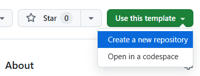
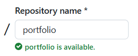
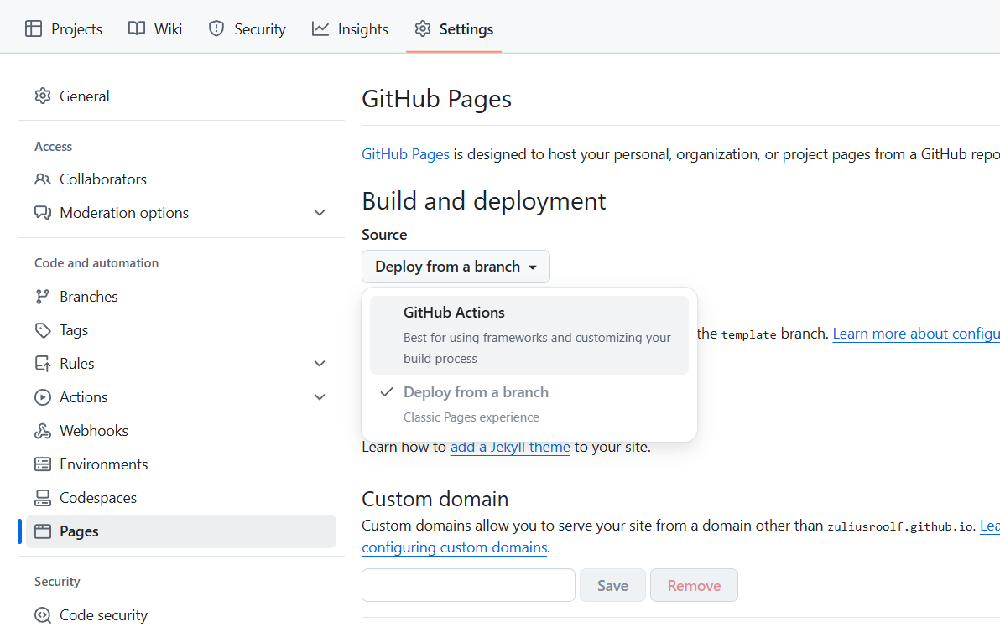
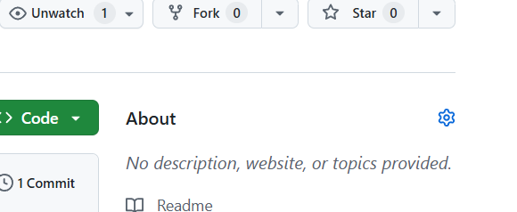
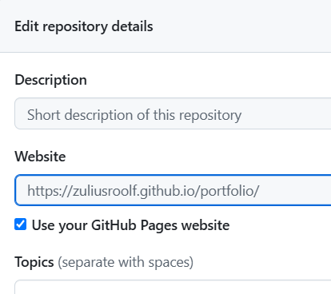

# Portfolio Template

A simple and stylish portfolio website to display your projects.
All content is stored in two json files for easy maintainability: [`biography`](./website/content/biography.json) and [`portfolio`](./website/content/portfolio.json).

The primary goal of this project was to learn the fundementals of web development, have something to showcase for employers and produce something that may contribute to others. These objectives were successfully achieved through 125 hours of active work.

## Features

- **Biography**:
  - Share your personal information with a professional touch.
  - Ultra clean design to let visitors focus on your projects.
  - Expandable "About" section to view your portrait and biography (only on desktop).
- **Portfolio**:
  - Present your achievements more clearly by visually showing them with media.
  - Highlight your projects interactively with detailed descriptions, collaborators and links.
  - Link to the full project for authenticity.

## Prerequisites

This template is hosted on GitHub Pages, so the only requirement is a GitHub account.

## Installation Instructions

1. **Clone the Template Repository**:
   - Navigate to the [template repository on GitHub](https://github.com/ZuliusRoolf/portfolio-template).
   - Click the **"Use this template"** button (visible when signed in to GitHub).  

   - Give the repository a fitting name, e.g. "portfolio".  

   - Continue with Create repository.

2. **Set Up GitHub Pages**:
   - Go to your newly created repository’s **Settings**.
   - Under **Pages**, configure GitHub Pages to use `GitHub Actions` as source.

   - No more configuration is needed :D

## Usage Instructions

1. **Host the Portfolio**:
   - After setting up GitHub Pages and pushing your first change, your portfolio will be live at `https://<your-username>.github.io/<repository-name>/`.
   - To make it a bit easier to access, go to **About** in the main repository view and click the gear icon.  

   - Under **Website** check the box beside "Use your GitHub Pages website" and Save changes.  

   - Now you will have a an easy link to your portfolio under **About**.

1. **Customize Your Portfolio**:
   - All easily editable files are in [`website/content`](./website/content) where you have folders for photos and videos, as well as the json files. Below are GitHub shortcuts to edit.
     - [`biography`](./website/content/biography.json)
     - [`portfolio projects`](./website/content/portfolio.json)
   - Commit and push your changes to the repository. The portfolio will automatically update via GitHub Actions. (Might take a while)
   - To change the tab icon, go to [`index.html`](./website/index.html) and change the file at `line 5`.
   - `graphic_assets` should not be touched, it has files the website needs.

## License

This template is distributed under the MIT License. This permissive license allows you to use, modify, and distribute the template freely.

## Shoutouts

- [Seyit Yilmaz](https://www.seyityilmaz.com/) for being such an amazing UX designer and creating the inspiration source for my implementation.
- @JushBJJ for developing [Mr. Ranedeer](https://github.com/JushBJJ/Mr.-Ranedeer-AI-Tutor) which supported my learning of web development.

## Creator's Commentary

For more information check out the [creator's journal](https://github.com/ZuliusRoolf/portfolio-template/blob/personal/JOURNAL.md) with (messy) documentation on the struggles, design choices and solutions throughout the development.
